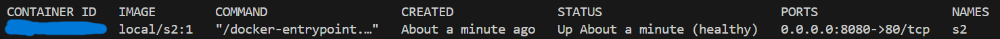
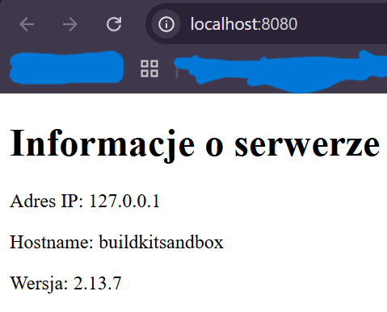

# BUILD
```
docker build -f Dockerfile -t local/s2:1 . 
```
# RUN
```
docker run --rm -d -p 8080:80 --name=s2 local/s2:1
```
# TEST
```
docker ps
```
example result:



# SCREENSHOT



# ABOUT
Adres ip => localhost 
Hostname => default
Wersja => from ARG
